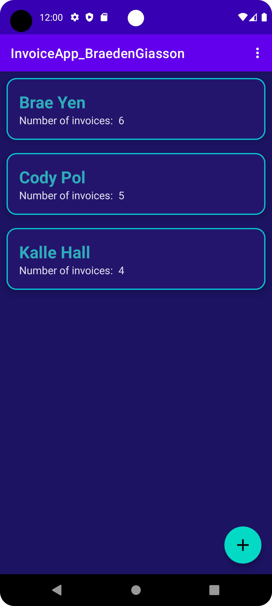

# :iphone: Invoicing App 

## :bookmark_tabs: Table of Contents

- **:question: [Why this Project?](#question-why-this-project)**
- :arrow_down: [**Android Studio Installation**](#arrow_down-android-studio-installation) 
- **:video_game: [Play the Game](#video_game-play-the-game)**
- **:open_file_folder: [Languages, Frameworks/Libraries, and Tools](#open_file_folder-languages-frameworkslibraries-and-tools)**

## :question: Why this Project?

This project was created as part of an **assignment** for one of my **Application Development** courses during my **Computer Science** studies at John Abbott College.

The **goal** of the assignment was to **create**, **design**, and **implement** an **Android App** using **Java** to implement **invoicing** for a customer/user.

A customer can add invoices to their profile, and can modify them as they please.

## :arrow_down: Android Studio Installation 

:warning: **If you already have Android Studio installed, [skip this part](#dart-getting-started).**   

**Before you begin to start my app, you will need Android Studio to run this project. Follow the links below to install them**:

- **[Install Android Studio - Video](https://developer.android.com/studio/install)**
- [**Install Android Studio - Guide**](https://developer.android.com/codelabs/basic-android-kotlin-compose-install-android-studio#0)

## :dart: Getting Started & Setup

**Now that you have Android Studio installed, it's time to clone my repo.**

#### Clone the repo

```
git clone https://github.com/BraedenGiasson/BraedensCountryGuesser.github.io.git
```

#### Open project

Now, you need to **open Android Studio**. Once opened, click on '**Open**' to open an existing project, and navigate to the **folder** you **cloned** the **repo** in. **Double click** on the project folder, or select the project folder, and click '**OK**', to open the project in Android Studio.

#### Virtual Device

Next, to **run the project** in an app, you will need to make sure you have a **virtual device** installed on **Android Studio**. Follow this **guide** to **create a virtual device** if you not already created:

- **[Create virtual devices](https://developer.android.com/studio/run/managing-avds)**

#### Configurations

If you need to **create a configuration** to run the project, follow this **guide** to add a **new configuration**:

- **[Create configurations](https://developer.android.com/studio/run/rundebugconfig)** 

#### Possible Gradle Errors

As a **developer**, you might **encounter some issues & errors** even before running/compiling the project. If this happens, follow this **guide** to help you **solve the issue(s)**:

- **[Known issues with Android Studio & Gradle](https://developer.android.com/studio/known-issues)**

## :iphone: Run the Project

After opening Android Studio and creating a virtual device, it's time for you to finally run my app! 

**Click the green ▶️ play button**, or press '**Shift + F10**' on your keyboard to run the app.

It will take some time for Gradle to run, but the app will open once finished.

:warning: If any **errors occur**, **refer to [this](https://developer.android.com/studio/known-issues) section** to help **solve** them. 

## :joystick: Usage

#### :scroll: Home Page

Once the app opens, you will be greeted with the **Home Page**. 

The **goal of this page** is to see a **list** of the **customers** registered on the app, the **number of invoices** they each have, and **create**, **edit**, and **delete** customers.

The user of the app can **click on a customer** to **show the customer details**.

The user also has the option to **create a new customer**, **edit an existing customer** or **delete an existing customer**.



#### :bulb: Creating a Customer
#### :pencil2: Editing a Customer
#### :x: Deleting a Customer
#### :scroll: Customer Page
#### :bulb: Creating an Invoice
#### :bulb: Creating an Invoice Detail
#### :pencil2: Editing an Invoice
#### :pencil2: Editing an Invoice Detail
#### :x: Deleting an Invoice Detail
#### :x: Deleting an Invoice
#### :bulb: Creating an Invoice
#### :scroll: Invoice Page
#### :gear: Settings

## :open_file_folder: Languages, Frameworks/Libraries, and Tools

<div>
	
        &nbsp;
            
        &nbsp;
    
        &nbsp;
</div>
