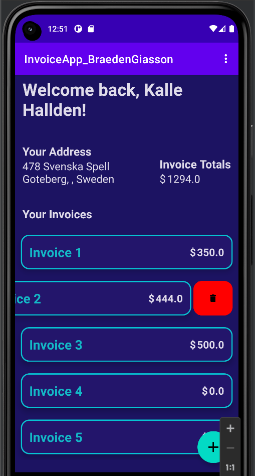
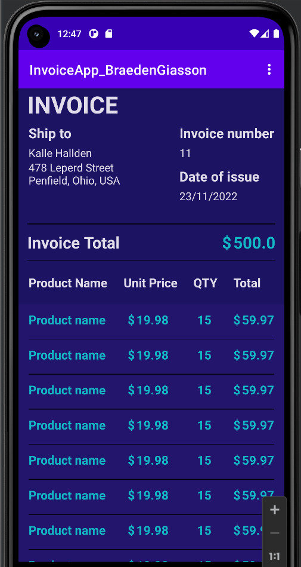
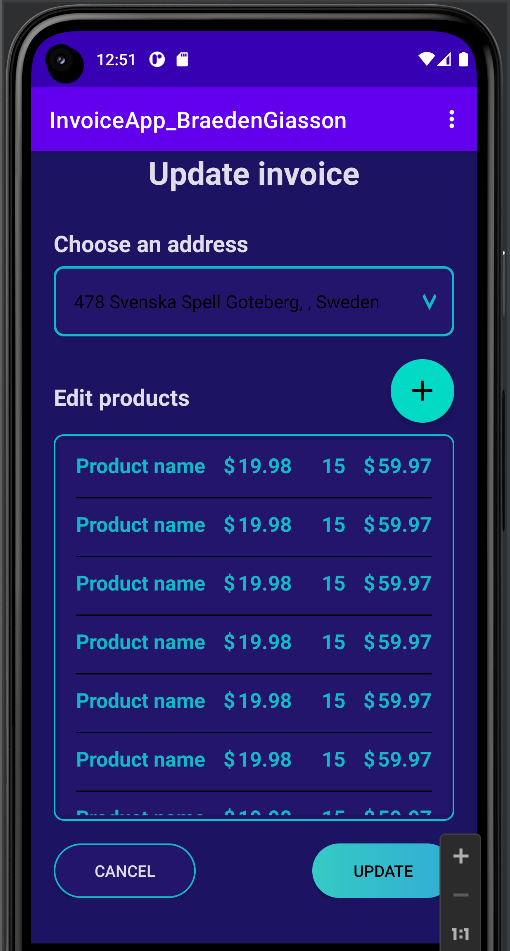

# :iphone: Invoicing App 

## :bookmark_tabs: Table of Contents

- **:question: [Why this Project?](#question-why-this-project)**
- :arrow_down: [**Android Studio Installation**](#arrow_down-android-studio-installation) 
- **:video_game: [Play the Game](#video_game-play-the-game)**
- **:open_file_folder: [Languages, Frameworks/Libraries, and Tools](#open_file_folder-languages-frameworkslibraries-and-tools)**

## :question: Why this Project?

This project was created as part of an **assignment** for one of my **Application Development** courses during my **Computer Science** studies at John Abbott College.

The **goal** of the assignment was to **create**, **design**, and **implement** an **Android App** using **Java** to implement **invoicing** for a customer/user.

A customer can add invoices to their profile, and can modify them as they please.

## :arrow_down: Android Studio Installation 

:warning: **If you already have Android Studio installed, [skip this part](#dart-getting-started).**   

**Before you begin to start my app, you will need Android Studio to run this project. Follow the links below to install them**:

- **[Install Android Studio - Video](https://developer.android.com/studio/install)**
- [**Install Android Studio - Guide**](https://developer.android.com/codelabs/basic-android-kotlin-compose-install-android-studio#0)

## :dart: Getting Started 

**Now that you have Android Studio installed, it's time to clone my repo.**

#### Clone the repo

```
git clone https://github.com/BraedenGiasson/BraedensCountryGuesser.github.io.git
```

#### Open project

Now, you need to **open Android Studio**. Once opened, click on '**Open**' to open an existing project, and navigate to the **folder** you **cloned** the **repo** in. **Double click** on the project folder, or select the project folder, and click '**OK**', to open the project in Android Studio.

## :joystick: Usage

:warning: **Coming soon!**

## :video_game: Play the Game

\* photo or gif *

**:warning: As the game is still under development, there is no link to play it yet. Coming soon!**

## :open_file_folder: Languages, Frameworks/Libraries, and Tools

<div>
	
        &nbsp;
            
        &nbsp;
        
        &nbsp;
    
        &nbsp;
    
        &nbsp;
    
        &nbsp;
    
        &nbsp;
</div>


Customer details page:



Invoice page:



Update invoice page:




These are just some of the pages in the app, explore for yourself to see more!
