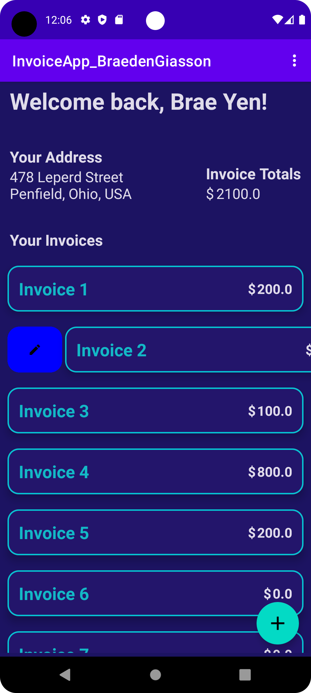

# :iphone: Invoicing App 

## :bookmark_tabs: Table of Contents

- **:question: [Why this Project?](#question-why-this-project)**
- :arrow_down: [**Android Studio Installation**](#arrow_down-android-studio-installation) 
- :dart: [**Getting Started & Setup**](#dart-getting-started--setup) 
- **:iphone: [Run the Project](#iphone-run-the-project)**
- **:joystick: [App Usage](#joystick-app-usage)**
  - **:scroll: [Home Page](#scroll-home-page)**
  -  **:bulb: [Creating a Customer](#bulb-creating-a-customer)**
  -  **:pencil2: [Editing a Customer](#pencil2-editing-a-customer)** 
  - **:x: [Deleting a Customer](#x-deleting-a-customer)**
  - **:scroll: [Customer Page](#scroll-customer-page)**
  - **:bulb: [Creating an Invoice](#bulb-creating-an-invoice)**
  - **:bulb: [Creating an Invoice Detail](#bulb-creating-an-invoice-detail)**
  - **:pencil2: [Editing an Invoice](#pencil2-editing-an-invoice)**
  - **:pencil2: [Editing an Invoice Detail](#pencil2-editing-an-invoice-detail)** 
  - **:x: [Deleting an Invoice Detail](#x-deleting-an-invoice-detail)** 
  - **:x: [Deleting an Invoice](#x-deleting-an-invoice)** 
  - **:scroll: [Invoice Page](#scroll-invoice-page)**
  - **:gear: [Settings](#gear-settings)** 

- **:open_file_folder: [Languages, Frameworks/Libraries, and Tools](#open_file_folder-languages-frameworkslibraries-and-tools)**

## :question: Why this Project?

This project was created as part of an **assignment** for one of my **Application Development** courses during my **Computer Science** studies at John Abbott College.

The **goal** of the assignment was to **create**, **design**, and **implement** an **Android App** using **Java** to implement **invoicing** for a customer/user.

A customer can add invoices to their profile, and can modify them as they please.

## :arrow_down: Android Studio Installation 

:warning: **If you already have Android Studio installed, [skip this part](#dart-getting-started).**   

**Before you begin to start my app, you will need Android Studio to run this project. Follow the links below to install them**:

- **[Install Android Studio - Video](https://developer.android.com/studio/install)**
- [**Install Android Studio - Guide**](https://developer.android.com/codelabs/basic-android-kotlin-compose-install-android-studio#0)

## :dart: Getting Started & Setup

**Now that you have Android Studio installed, it's time to clone my repo.**

#### Clone the repo

```
git clone https://github.com/BraedenGiasson/BraedensCountryGuesser.github.io.git
```

#### Open project

Now, you need to **open Android Studio**. Once opened, click on '**Open**' to open an existing project, and navigate to the **folder** you **cloned** the **repo** in. **Double click** on the project folder, or select the project folder, and click '**OK**', to open the project in Android Studio.

#### Virtual Device

Next, to **run the project** in an app, you will need to make sure you have a **virtual device** installed on **Android Studio**. Follow this **guide** to **create a virtual device** if you not already created:

- **[Create virtual devices](https://developer.android.com/studio/run/managing-avds)**

#### Configurations

If you need to **create a configuration** to run the project, follow this **guide** to add a **new configuration**:

- **[Create configurations](https://developer.android.com/studio/run/rundebugconfig)** 

#### Possible Gradle Errors

As a **developer**, you might **encounter some issues & errors** even before running/compiling the project. If this happens, follow this **guide** to help you **solve the issue(s)**:

- **[Known issues with Android Studio & Gradle](https://developer.android.com/studio/known-issues)**

## :iphone: Run the Project

After opening Android Studio and creating a virtual device, it's time for you to finally run my app! 

**Click the green ▶️ play button**, or press '**Shift + F10**' on your keyboard to run the app.

It will take some time for Gradle to run, but the app will open once finished.

:warning: If any **errors occur**, **refer to [this](#possible-gradle-errors) section** to help **solve** them. 

## :joystick: App Usage

#### :scroll: Home Page

Once the app opens, you will be greeted with the **Home Page**. 

The **goal of this page** is to see a **list** of the **customers** registered on the app, the **number of invoices** they each have, and **create**, **edit**, and **delete** customers.

The **user of the app** can **click on a customer** to **show the customer details**.

The **user** also has the option to :bulb: **[create a new customer](#bulb-creating-a-customer)**, :pencil2: **[edit an existing customer](#pencil2-editing-a-customer)**, or :x: **[delete an existing customer](#x-deleting-a-customer)**.


#### :bulb: Creating a Customer

The **goal of this page** is to **create a new customer** for the invoicing app.

The **user of the app** has to **input the necessary data** in the **corresponding input fields**.

Since a customer can have multiple addresses, if **checked**, the '**Set as default address**' box indicates that the **current address** in the input field will be the **customer's default address**.

:white_check_mark: Click '**Create**' to create the new customer.

:x: Click '**Cancel**' to cancel creating the new customer.


#### :pencil2: Editing a Customer

The **goal of this page** is to **update the existing details of a customer**.

The **user of the app** can :arrow_right: **swipe right** on a customer, and **click the blue button** to go to the editing page. 

The **user** can **edit the first & last names**, and **choose a different address**.

They can also **add new addresses** to the customer profile, or **edit existing addresses** for the customer.

:white_check_mark: Click '**Update**' to update the customer.

:x: Click '**Cancel**' to cancel updating the customer.

<div style="display: flex; flex-direction: row; justify-content: space-between;">

    
</div>

#### :x: Deleting a Customer

The **goal of this action** is to **delete an existing customer**.

The **user of the app** can :arrow_left: **swipe left** on a customer, and **click the red button** to **delete** the customer. 

The **user** will be asked to **confirm** if they really want to **delete the customer**. 


#### :scroll: Customer Page

The **goal of this page** is to **show the details of a customer**.

The **customer** can see their **address**, the **total amount for all invoices**, and a **list of their different invoices** and long with **each total**.

The **customer** has the option to :scroll: **[show the invoice](#scroll-invoice-page)**, :bulb: **[create a new invoice](#bulb-creating-an-invoice)**, :pencil2: **[edit an existing invoice](#pencil2-editing-an-invoice)**, or :x: **[delete an existing invoice](#x-deleting-an-invoice)**.


#### :bulb: Creating an Invoice

The **goal of this page** is to **create a new invoice** for the **customer**.

The **customer** has to **choose a delivery address**, and can **optionally add invoice product details** for the invoice. It is **not necessary** to **add product details** upon initially **creating the invoice**, this can also be done when **editing the invoice**.

:white_check_mark: Click '**Create**' to create the new invoice.

:x: Click '**Cancel**' to cancel creating the new invoice.


#### :bulb: Creating an Invoice Detail

The **goal of this page** is to **create a new invoice product detail** for the **invoice**.

The **customer** has to **input the product name**, the **price of the product**, and the **quantity of the product**.

:white_check_mark: Click '**Add**' to add the new invoice product detail for the invoice.

:x: Click '**Cancel**' to cancel adding the new invoice product detail for the invoice.


#### :pencil2: Editing an Invoice

The **goal of this page** is to **update the existing details of an invoice**.

The **customer** can :arrow_right: **swipe right** on a invoice, and **click the blue button** to go to the editing page. 

The **customer** can **choose a different delivery address**, and can also :bulb: **[add a new invoice product detail](#bulb-creating-an-invoice-detail)**, :pencil2: **[edit existing product details](#pencil2-editing-an-invoice-detail)**, and :x: **[delete existing product details](#x-deleting-an-invoice-detail)**.

:white_check_mark: Click '**Update**' to update the invoice.

:x: Click '**Cancel**' to cancel updating the invoice.

<div style="display: flex; flex-direction: row; justify-content: space-between;">

    
</div>

#### :pencil2: Editing an Invoice Detail

The **goal of this page** is to **update the existing details of an invoice product detail**.

The **customer** can :arrow_right: **swipe right** on a invoice detail, and **click the blue button** to go to the editing popup. 

The **customer** can **change the product name**, the **price of the product**, and the **quantity of the product**.

:white_check_mark: Click '**Update**' to update the invoice detail.

:x: Click '**Cancel**' to cancel updating the invoice detail.

<div style="display: flex; flex-direction: row; justify-content: space-between;">

    
</div>

#### :x: Deleting an Invoice Detail

The **goal of this action** is to **delete an existing invoice product detail** on an **invoice**.

The **customer** can :arrow_left: **swipe left** on an invoice product detail, and **click the red button** to **delete** the invoice product detail. 

The **customer** will be asked to **confirm** if they really want to **delete the invoice product detail**. 


#### :x: Deleting an Invoice

The **goal of this action** is to **delete an existing invoice** on an **customer**.

The **customer** can :arrow_left: **swipe left** on an invoice, and **click the red button** to **delete** the invoice. 

The **customer** will be asked to **confirm** if they really want to **delete the invoice**. 


#### :scroll: Invoice Page

The **goal of this page** is to **show the details of an invoice** for a **customer**.

The **customer** can see their **delivery address**, the **invoice number**, the **date of issue of the invoice**, the **total amount for all invoices**, and a **list of all invoice product details** for that invoice.


#### :gear: Settings

The **goal of this page** is to **show & edit the settings** of the app.

The **user of the app** can **edit a company name**, and the **number of employees** at said company.

**:warning: The settings page is not for use, it was just a requirement for the assignment.**


## :open_file_folder: Languages, Frameworks/Libraries, and Tools

<div>
	
        &nbsp;
            
        &nbsp;
    
        &nbsp;
</div>
